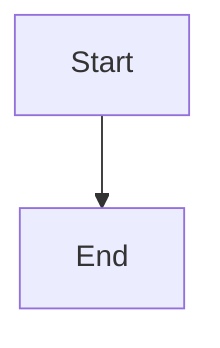

# Verifyica Documentation Site

This directory contains the Hugo + Docsy documentation site for Verifyica.

## Prerequisites

- **Hugo Extended** version 0.110.0 or later ([download](https://gohugo.io/installation/))
- **Node.js** version 16+ and npm
- **Go** version 1.20+ (for Hugo modules)

## Quick Start

### Initial Setup

```bash
# Install npm dependencies
npm install

# Fetch Hugo modules (Docsy theme)
hugo mod get -u
```

### Development

Run the development server with live reload:

```bash
hugo server -D
```

The site will be available at http://localhost:1313/

### Production Build

Build the site for production:

```bash
hugo --gc --minify
```

The generated site will be in the `public/` directory.

## Project Structure

```
docs/
├── config.toml              # Hugo configuration
├── package.json             # npm dependencies
├── go.mod                   # Hugo modules
├── content/en/              # Documentation content
│   ├── _index.md           # Home page
│   ├── docs/               # Documentation sections
│   │   ├── getting-started/
│   │   ├── core-concepts/
│   │   ├── configuration/
│   │   ├── api-reference/
│   │   ├── advanced/
│   │   ├── examples/
│   │   └── troubleshooting/
│   └── about/              # About section
├── static/                  # Static assets
│   └── images/             # Images
├── layouts/                 # Custom layouts
│   └── shortcodes/         # Custom shortcodes
└── public/                 # Generated site (gitignored)
```

## Adding Content

### Create a New Page

```bash
hugo new content/en/docs/section/page-name.md
```

### Page Front Matter

```yaml
---
title: "Page Title"
linkTitle: "Short Title"
weight: 10
description: >
  Page description
---
```

### Mermaid Diagrams

Mermaid diagrams are supported:

````markdown

````

## Configuration

### Main Configuration

Edit `config.toml` to configure:
- Site metadata
- Navigation menus
- Theme settings
- Search configuration
- GitHub integration

### Theme Customization

The Docsy theme is imported via Hugo Modules. See [Docsy documentation](https://www.docsy.dev/) for customization options.

## Deployment

### GitHub Pages

Add a GitHub Actions workflow to `.github/workflows/gh-pages.yml`:

```yaml
name: Deploy Hugo Site

on:
  push:
    branches: [main]

jobs:
  deploy:
    runs-on: ubuntu-latest
    steps:
      - uses: actions/checkout@v4
        with:
          submodules: recursive

      - name: Setup Hugo
        uses: peaceiris/actions-hugo@v2
        with:
          hugo-version: 'latest'
          extended: true

      - name: Setup Node
        uses: actions/setup-node@v4
        with:
          node-version: '20'

      - name: Install dependencies
        run: cd docs && npm install

      - name: Build
        run: cd docs && hugo --gc --minify

      - name: Deploy
        uses: peaceiris/actions-gh-pages@v3
        with:
          github_token: ${{ secrets.GITHUB_TOKEN }}
          publish_dir: ./docs/public
```

### Other Platforms

The site can be deployed to:
- **Netlify**: Connect your Git repository and set build command to `cd docs && hugo --gc --minify`
- **Vercel**: Similar to Netlify
- **Any static host**: Upload the `public/` directory contents

## Troubleshooting

### Hugo Version Issues

Ensure you're using Hugo Extended (not regular Hugo):

```bash
hugo version
# Should show "extended" in the output
```

### Module Issues

If you encounter module errors:

```bash
hugo mod clean
hugo mod get -u
hugo mod tidy
```

### Build Errors

Enable verbose logging:

```bash
hugo --verbose
```

## Contributing

When contributing documentation:

1. Follow the existing structure and style
2. Use proper front matter with weight for ordering
3. Include code examples where appropriate
4. Test locally with `hugo server -D`
5. Build with `hugo --gc --minify` to check for errors

## Resources

- [Hugo Documentation](https://gohugo.io/documentation/)
- [Docsy Theme Documentation](https://www.docsy.dev/docs/)
- [Verifyica GitHub Repository](https://github.com/verifyica-team/verifyica)

## License

The Verifyica documentation is licensed under the Apache License 2.0.
