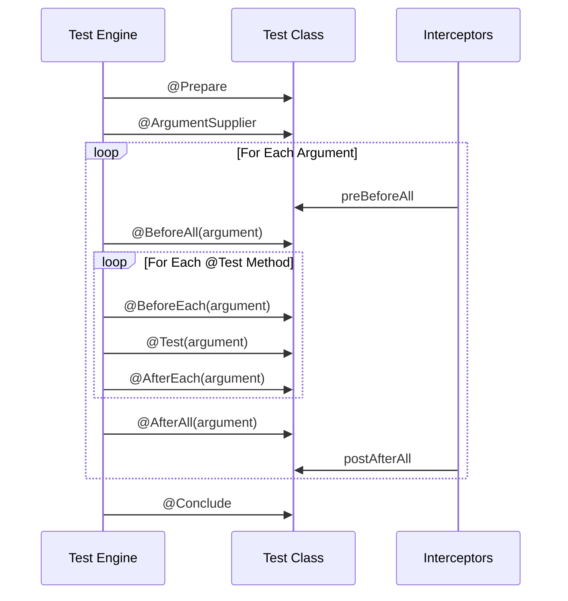

Verifyica provides a comprehensive test lifecycle that gives you fine-grained control over setup and teardown at multiple levels.

## Lifecycle Overview

Unlike traditional testing frameworks that only provide before/after hooks, Verifyica offers a complete lifecycle with five distinct phases:

1. **Prepare** - One-time setup before any arguments are processed
2. **BeforeAll** - Setup for each argument (before its tests)
3. **BeforeEach** - Setup before each individual test method
4. **Test** - The actual test execution
5. **AfterEach** - Cleanup after each individual test method
6. **AfterAll** - Cleanup for each argument (after its tests)
7. **Conclude** - One-time cleanup after all arguments are processed

## Lifecycle Diagram



## Lifecycle Annotations

### @Prepare

Executes once before any arguments are processed.

```java
@Verifyica.Prepare
public void prepare() {
    // Called once before all arguments
    // Use for: Starting services, initializing shared resources
}
```

**When to use:**
- Starting external services (databases, web servers)
- Loading shared configuration
- Initializing expensive resources used by all arguments
- Setting up test environment

**Example:**
```java
@Verifyica.Prepare
public void prepare() {
    System.setProperty("test.mode", "true");
    SharedResourcePool.initialize();
    TestDatabase.start();
}
```

### @ArgumentSupplier

Provides the test arguments (covered in detail in [Arguments](../arguments/)).

```java
@Verifyica.ArgumentSupplier(parallelism = 2)
public static Object arguments() {
    return Arrays.asList("arg1", "arg2", "arg3");
}
```

### @BeforeAll

Executes once per argument, before any test methods run for that argument.

```java
@Verifyica.BeforeAll
public void beforeAll(String argument) {
    // Called once per argument before its tests
    // Use for: Creating connections, setting up argument-specific state
}
```

**When to use:**
- Creating database connections for this argument
- Setting up argument-specific resources
- Initializing state shared across test methods for this argument
- Performing expensive setup that can be reused

**Example:**
```java
private DatabaseConnection connection;

@Verifyica.BeforeAll
public void beforeAll(DatabaseConfig config) {
    connection = new DatabaseConnection(config);
    connection.connect();
    connection.createSchema();
    connection.loadTestData();
}
```

**Note:** This simple example assumes sequential argument execution (parallelism = 1). For parallel arguments, use a `Map<String, Connection>` to isolate connections per argument. See [Managing State with Instance Variables](#managing-state-with-instance-variables) below.

### @BeforeEach

Executes before each test method for each argument.

```java
@Verifyica.BeforeEach
public void beforeEach(String argument) {
    // Called before each test method
    // Use for: Resetting state, clearing caches, preparing test data
}
```

**When to use:**
- Resetting shared state between tests
- Clearing caches or temporary data
- Creating test-specific resources
- Ensuring test isolation

**Example:**
```java
@Verifyica.BeforeEach
public void beforeEach(DatabaseConfig config) {
    connection.clearTables();
    connection.resetSequences();
    testDataBuilder = new TestDataBuilder();
}
```

### @Test

The actual test method that contains your test logic.

```java
@Verifyica.Test
public void testSomething(String argument) {
    // Test logic
    // Executes once per argument
}
```

**Multiple test methods:**
```java
@Verifyica.Test
public void testCreation(Config config) {
    Service service = new Service(config);
    assert service != null;
}

@Verifyica.Test
public void testOperation(Config config) {
    Service service = new Service(config);
    Result result = service.execute();
    assert result.isSuccess();
}
```

Each `@Test` method executes for every argument, with `@BeforeEach` and `@AfterEach` surrounding each execution.

### @AfterEach

Executes after each test method for each argument.

```java
@Verifyica.AfterEach
public void afterEach(String argument) {
    // Called after each test method
    // Use for: Cleaning up test-specific resources
}
```

**When to use:**
- Cleaning up test-specific resources
- Removing temporary files or data
- Resetting mocks or stubs
- Capturing test metrics or logs

**Example:**
```java
@Verifyica.AfterEach
public void afterEach(DatabaseConfig config) {
    connection.rollback();
    tempFileManager.cleanupTestFiles();
    metricCollector.recordTestExecution();
}
```

### @AfterAll

Executes once per argument, after all test methods run for that argument.

```java
@Verifyica.AfterAll
public void afterAll(String argument) {
    // Called once per argument after its tests
    // Use for: Closing connections, releasing argument-specific resources
}
```

**When to use:**
- Closing database connections
- Releasing argument-specific resources
- Saving test reports or metrics
- Performing final cleanup for this argument

**Example:**
```java
@Verifyica.AfterAll
public void afterAll(DatabaseConfig config) {
    connection.dropSchema();
    connection.disconnect();
    reportGenerator.saveReport(config.getName());
}
```

### @Conclude

Executes once after all arguments are processed.

```java
@Verifyica.Conclude
public void conclude() {
    // Called once after all arguments
    // Use for: Stopping services, generating aggregate reports
}
```

**When to use:**
- Stopping external services
- Generating aggregate test reports
- Cleaning up shared resources
- Performing final validation

**Example:**
```java
@Verifyica.Conclude
public void conclude() {
    TestDatabase.stop();
    SharedResourcePool.shutdown();
    AggregateReportGenerator.generateReport();
}
```

## Complete Lifecycle Example

```java
package com.example.tests;

import org.verifyica.api.Argument;
import org.verifyica.api.Verifyica;
import java.util.Arrays;
import java.util.Collection;

public class CompleteLifecycleTest {

    private static TestServer server;
    private HttpClient client;

    @Verifyica.Prepare
    public void prepare() {
        System.out.println("1. Prepare: Starting test server");
        server = new TestServer();
        server.start();
    }

    @Verifyica.ArgumentSupplier(parallelism = 2)
    public static Collection<Argument<Config>> arguments() {
        System.out.println("2. ArgumentSupplier: Generating arguments");
        return Arrays.asList(
            Argument.of("http-config", new Config("http", 8080)),
            Argument.of("https-config", new Config("https", 8443))
        );
    }

    @Verifyica.BeforeAll
    public void beforeAll(Config config) {
        System.out.println("3. BeforeAll: Setting up for " + config);
        client = new HttpClient(config);
        client.connect();
    }

    @Verifyica.BeforeEach
    public void beforeEach(Config config) {
        System.out.println("4. BeforeEach: Preparing for test with " + config);
        client.clearCookies();
        server.resetState();
    }

    @Verifyica.Test
    public void test1(Config config) {
        System.out.println("5. Test1: Testing with " + config);
        Response response = client.get("/api/test");
        assert response.getStatus() == 200;
    }

    @Verifyica.Test
    public void test2(Config config) {
        System.out.println("5. Test2: Testing with " + config);
        Response response = client.post("/api/data", "payload");
        assert response.getStatus() == 201;
    }

    @Verifyica.AfterEach
    public void afterEach(Config config) {
        System.out.println("6. AfterEach: Cleaning up after test with " + config);
        server.clearTestData();
    }

    @Verifyica.AfterAll
    public void afterAll(Config config) {
        System.out.println("7. AfterAll: Tearing down for " + config);
        client.disconnect();
    }

    @Verifyica.Conclude
    public void conclude() {
        System.out.println("8. Conclude: Stopping test server");
        server.stop();
    }
}
```

### Execution Flow

With 2 arguments and 2 test methods, the execution is:

```
1. Prepare
2. ArgumentSupplier
   --- Argument: http-config ---
   3. BeforeAll (http-config)
      4. BeforeEach (http-config)
      5. Test1 (http-config)
      6. AfterEach (http-config)
      4. BeforeEach (http-config)
      5. Test2 (http-config)
      6. AfterEach (http-config)
   7. AfterAll (http-config)
   --- Argument: https-config ---
   3. BeforeAll (https-config)
      4. BeforeEach (https-config)
      5. Test1 (https-config)
      6. AfterEach (https-config)
      4. BeforeEach (https-config)
      5. Test2 (https-config)
      6. AfterEach (https-config)
   7. AfterAll (https-config)
8. Conclude
```

With `parallelism = 2`, both arguments may execute concurrently (http-config and https-config in parallel).

## Error Handling in Lifecycle

### Exceptions in @Prepare

If `@Prepare` throws an exception, test execution stops immediately:

```java
@Verifyica.Prepare
public void prepare() throws Exception {
    if (!canStartTestServer()) {
        throw new RuntimeException("Cannot start test server");
    }
    server.start(); // Not executed if exception thrown
}
```

**Result:** No arguments are processed, all tests are skipped.

### Exceptions in @BeforeAll

If `@BeforeAll` throws an exception for an argument, all tests for that argument are skipped:

```java
@Verifyica.BeforeAll
public void beforeAll(Config config) throws Exception {
    connection = database.connect(config);
    if (connection == null) {
        throw new RuntimeException("Failed to connect to " + config);
    }
}
```

**Result:** Tests for this argument are skipped, other arguments continue.

### Exceptions in @BeforeEach

If `@BeforeEach` throws an exception, the test method is skipped but other tests continue:

```java
@Verifyica.BeforeEach
public void beforeEach(Config config) {
    if (!prerequisitesMet()) {
        throw new TestSkippedException("Prerequisites not met");
    }
}
```

**Result:** Current test is skipped, next test method proceeds.

### Exceptions in @Test

Test failures are reported normally:

```java
@Verifyica.Test
public void test(Config config) {
    Result result = service.execute(config);
    if (!result.isSuccess()) {
        throw new AssertionError("Test failed: " + result.getError());
    }
}
```

**Result:** Test marked as failed, lifecycle continues (@AfterEach, other tests).

### @AfterEach and @AfterAll Always Execute

Even if tests fail, cleanup methods execute:

```java
@Verifyica.Test
public void test(Config config) {
    throw new RuntimeException("Test failed!");
}

@Verifyica.AfterEach
public void afterEach(Config config) {
    // Still executes even though test failed
    cleanup();
}

@Verifyica.AfterAll
public void afterAll(Config config) {
    // Still executes even if tests failed
    connection.close();
}
```

This ensures proper resource cleanup regardless of test outcomes.

### @Conclude Always Executes

`@Conclude` executes even if all tests fail:

```java
@Verifyica.Conclude
public void conclude() {
    // Always executes at the end
    server.stop();
    cleanupGlobalResources();
}
```

## Lifecycle Best Practices

### Use the Right Hook for the Right Job

```java
// Good: Expensive setup in @BeforeAll
@Verifyica.BeforeAll
public void beforeAll(Config config) {
    connection = database.connect(config); // Expensive, do once per argument
}

// Bad: Expensive setup in @BeforeEach
@Verifyica.BeforeEach
public void beforeEach(Config config) {
    connection = database.connect(config); // Wasteful, reconnects for every test!
}
```

**Note:** This example shows efficiency patterns. For thread-safe state management with parallel arguments, use context classes stored in the ArgumentContext map. See [Managing State with Instance Variables](#managing-state-with-instance-variables).

### Keep @Prepare and @Conclude Fast

These methods block all test execution:

```java
// Good: Only essential global setup
@Verifyica.Prepare
public void prepare() {
    System.setProperty("test.mode", "true");
}

// Bad: Slow operations in @Prepare
@Verifyica.Prepare
public void prepare() throws InterruptedException {
    Thread.sleep(10000); // Blocks everything for 10 seconds!
}
```

### Always Clean Up in @AfterAll

Even if tests fail, clean up resources:

```java
@Verifyica.AfterAll
public void afterAll(Config config) {
    try {
        if (connection != null) {
            connection.close();
        }
    } catch (Exception e) {
        // Log but don't throw - don't cascade failures
        logger.warn("Failed to close connection", e);
    }
}
```

### Managing State with Instance Variables

**Important:** A single test class instance is shared across all arguments, so instance variables must be managed carefully, especially with parallel execution.

#### Safe Pattern: Use Context Classes for Per-Argument State

```java
public class DatabaseTest {
    // Define a context class to encapsulate per-argument state
    public static class TestContext {
        private final Connection connection;

        public TestContext(Connection connection) {
            this.connection = connection;
        }

        public Connection getConnection() {
            return connection;
        }
    }

    @Verifyica.BeforeAll
    public void beforeAll(ArgumentContext argumentContext) {
        Config config = argumentContext.getArgument().getPayloadAs(Config.class);
        Connection conn = database.connect(config);

        // Store context in ArgumentContext map (thread-safe)
        TestContext context = new TestContext(conn);
        argumentContext.getMap().put("testContext", context);
    }

    @Verifyica.Test
    public void test1(ArgumentContext argumentContext) {
        TestContext context = (TestContext) argumentContext.getMap().get("testContext");
        context.getConnection().execute("SELECT 1"); // Uses correct connection for this argument
    }

    @Verifyica.Test
    public void test2(ArgumentContext argumentContext) {
        TestContext context = (TestContext) argumentContext.getMap().get("testContext");
        context.getConnection().execute("SELECT 2"); // Uses same argument's connection
    }

    @Verifyica.AfterAll
    public void afterAll(ArgumentContext argumentContext) {
        TestContext context = (TestContext) argumentContext.getMap().get("testContext");
        if (context != null && context.getConnection() != null) {
            context.getConnection().close();
        }
    }
}
```

**Note:** Using context classes provides clean encapsulation and works safely with any parallelism configuration.

## Next Steps

- [Contexts](../contexts/) - Access lifecycle execution state via context objects
- [Interceptors](../interceptors/) - Hook into lifecycle execution
- [Execution Model](../execution-model/) - Understand how lifecycle phases execute
